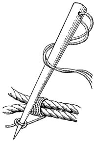
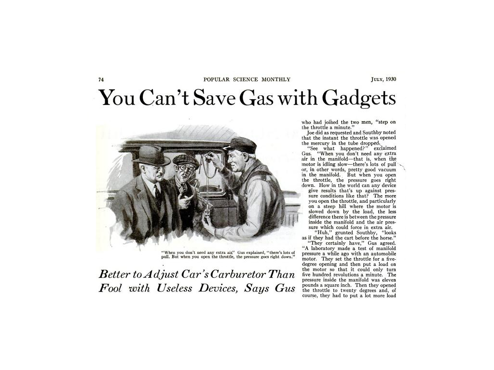
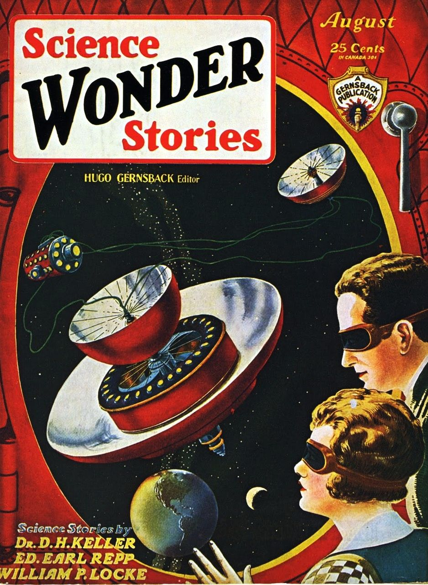

% From Marlinspike to Mobile Media
% Grant Wythoff \| Columbia University
% November 14, 2013\
    \
    Society of Fellows Luncheon Lecture Series

# 
From Marlinspike to Mobile Media

## 

## 

## 

## 

##

"I have found Americans out. They are gadget-minded. They have created a touch-the-button civilization."\
-Joseph Fort Newton, 1937

"The machinery of propaganda is made of standardized gadgets by which you can detect it. One of these gadgets is slogans."\
-Herbert Hoover, 1949

## 

# 

# 

#

"Two hundred years ago, stories of this kind were not possible."\
-Gernsback, "A New Sort of Magazine," 1927

# 

# 

# 

====

# unused slides