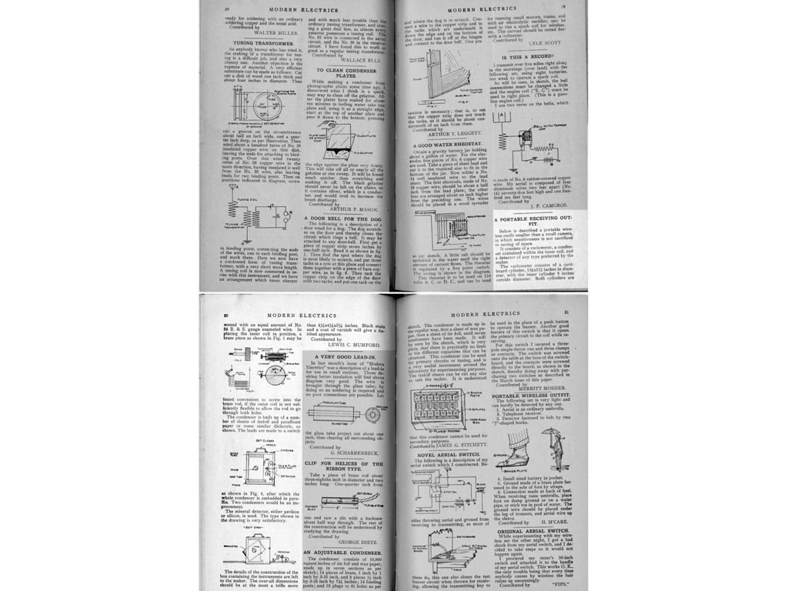

% From Marlinspike to Mobile Media
% Grant Wythoff \| Columbia University
% November 14, 2013
% Society of Fellows Lunchtime Lecture Series

> Two hundred years ago, stories of this kind were not possible.\
-Gernsback, "A New Sort of Magazine" (1927)

* * * * * *

# Everyday Estrangement

Cognitive Estrangement

> \[a genre]\ whose main formal device is an imaginative framework alternative to the author's empirical environment.

According to this model, science fiction is premised on a process of “estrangement” in that the literary gambit of the individual work consists of a “what if” question directed away from whatever we accept to be this world.  Importantly, this movement away from our world must be “cognitive.”  That is, the fictional hypothesis of the work is elaborated with objective, “scientific” rigor—it has to be plausible.  These two elements of the science fictional narrative are intimately connected in that “the cognitive nucleus of the plot codetermines the fictional estrangement itself.”  This is to say, the aesthetic of SF’s estrangement from our world—in a “gesture of pointing, a wide-eyed glance from here to there, a ‘traveling shot’ from the author’s everyday lookout to the wondrous panorama of a far-off land”—resides in the totality and complexity of its relations with the given.

It’s only now that attacks on this formulation of science fiction’s supposedly defining feature are gaining any traction.  Samuel R. Delany, who questions whether nailing down a concrete definition of science fiction is at all a useful critical endeavor in the first place, was one early detractor of Suvin’s work.  Delany argues that “the presence and interaction of estrangement and cognition in a literary work are simply and blatantly insufficient to produce SF.  If they interact in one way, they produce fantasy.  If they interact in another, they produce surrealism.  If they interact in still another, they produce criticism.”  China Miéville takes a more pointed approach in his contribution to a recent volume on Marxism in science fiction, drawing attention to the way that cognition in Suvin’s account is premised on an uncritical and monolithic ideal of science.  Miéville writes, “To the extent that SF claims to be based on ‘science,’ and indeed on what is deemed ‘rationality,’ it is based on capitalist modernity’s ideologically projected self-justification: not some abstract/ideal ‘science,’ but capitalist science’s bullshit about itself.”  This idealization of science ignores not only the social construction of what counts as scientific fact, but also the works inspired by the New Wave of 1960s science fiction whose extrapolations proceed not from “science” but conceptions of gender, race, class, psychology, and sexuality.

For other critics, the fact that Suvin focuses only on literary works of science fiction (a model which, furthermore, he admits excludes 95% of what is published as science fiction) is enough to render his model useless, as it ignores the output of the genre in comics, films, television, performance and visual art, and even some types of critical theory.  Istvan Csicsery-Ronay takes a more catholic approach in The Seven Beauties of Science Fiction (2008), a catalog of the formal markers native to the genre.  Surveying the many varieties of aesthetic experience science fiction can take up in all of its various media, Csicsery-Ronay even allows for the possibility that science fiction might be seen as a certain modality of lived experience in our thoroughly “technologized world.”
        
The widespread normalization of what is essentially a style of estrangement and dislocation has stimulated the development of science-fictional habits of mind, so that we no longer treat SF as purely a genre-engine producing formulaic effects, but rather as a kind of awareness we might call science-fictionality, a mode of response that frames and tests experiences as if they were aspects of a work of science fiction. […] Most people merely bracket difficult-to-process, incongruous moments of technology’s intersection with everyday life as science-fictional moments.

This affective turn toward “science fictionality,” an expansion of the poetics of a literary genre into a category of experience, constitutes one of the more interesting developments in science fiction studies over the past couple decades.  In its simplest formulation, the idea circulates as a truism that “The world finally has caught up with science fiction.”  Many instances of this saying attempt to highlight the way in which the pace of technological change feels like it outpaces any attempt to understand the significance of that incursion in our daily lives.  Others try to come to terms with the fact that many of the genre’s imagined futures never came to pass, as in the popularity of retrofuturist books like Where’s My Jetpack? and blogs like Paleofuture, both of which catalog images of futures past that sync up with the present in uncanny ways.

Some scholars in science fiction studies encouraged a shift toward the science fictionality of everyday life in order to account for a media historically specific shift.  Brooks Landon, for instance, writes in 1992 of his “belief that contemporary electronic technology has so displaced the savor of potentiality from stories about ‘great vistas in time and space’ to ways in which we actually experience time and space anew, that our culture now unconsciously brings to the experience of film and electronic media expectations very similar to those of the traditional SF reader.”  For yet another camp of science fiction critics, the experience of science fictionality itself is the product of a postmodern accretion of text upon text to the point that “the literature of the future has a long and honored past,” as Bruce Sterling writes in the preface to his famous anthology of cyberpunk fiction, Mirrorshades.  Describing the 1980s movement that encompassed not only fiction writers but poets, fashion designers, and fan cultures, he continues, “The cyberpunks are perhaps the first SF generation to grow up not only within the literary tradition of science fiction but in a truly science-fictional world,” and so they sought to capture “the overlapping of worlds that were formerly separate: the realm of high tech, and the modern pop underground.”

While critical discussions on science fictionality were launched in order to describe certain contours of the contemporary moment, the sense that the world has caught up with its own fantastic dreams is not a recent development, as we’ve seen.  Many film and media scholars have remarked for some time on the inherent science fictionality of media technologies and their realignment of our sense of time and space, the cinema chief among them.  What type of literary, or rather “fictional” history would result if this approach to science fiction as a particular form of everyday experience was projected back into a reevaluation of the genre as a whole, rather than confined to a particular historical moment within it?  Instead of understanding “science fictionality” as the product of a postmodern accretion of images and narratives, how might we instead revise our understanding of science fiction’s literary history so that it might be seen as a structural inheritance of the genre’s very origins?  

In many ways, by putting forward an extra-literary model of science fiction as a kind of experience that arises in the everyday, recent critics are returning to the intellectual core of Suvin’s theory even as they seek to revise it.  The genealogy of Suvin’s concept of “estrangement” lies precisely in such an attempt to account for everyday experience, drawing heavily upon Russian formalist literary critic Viktor Shklovsky’s concept of ostranenie, translated most commonly as “defamiliarization,”  For Shklovsky, all art possesses the ability to militate against the habituation of perception, the process by which the monotony of our daily experience causes objects to “retreat into the area of the unconsciously automatic.”  Picking up a hammer for the first time is a completely different experience when one compares it to holding that tool for the ten thousandth time.  Much like Heidegger’s account of the way in which the tool disappears into a work process, some form of exteriorization or distance from that tool is required to understand its essence in any way.  For Heidegger, this occurs when the tool breaks.

But for Shklovsky, it is art that exists to “make the stone stony,” as he puts it.  “The technique of art is to make objects ‘unfamiliar,’ to make forms difficult, to increase the difficulty and length of perception because the process of perception is an aesthetic end in itself and must be prolonged.  Art is a way of experiencing the artfulness of an object: the object is not important.”  The end goal of Shklovsky’s reorientation toward objects that have retreated into the invisibility of habit is not to achieve a new kind of knowledge about the object.  For Shklovsky, perception is a process wholly different from knowledge (thus forcing Suvin to modify the Russian formalist account so that it might be used as a descriptor of science fiction, which involves a “cognitive,” or empirical, form of estrangement).  Shklovsky writes, “Defamiliarization is found almost anywhere form is found. […] Its purpose is not to make us perceive meaning, but to create a special perception of the object—it creates a vision of the object instead of serving as a means for knowing it.”  Suvin on the other hand places an emphasis on estrangement as the confrontation of “a set normative system—a Ptolemaic-type closed world picture—with a point of view or glance implying a new set of norms.”  But this confrontation need not be the sole province of literary fiction, with its systematic construction of fictional worlds through narrative means.  Estrangement is simply the process by which any form of aesthetic representation allows us to hold an everyday object at arm’s length, to make it strangely new once again. 

Shklovsky’s ostranenie highlights the aesthetics of what Bernard Stiegler calls “technics and time”:  the temporal frameworks into which we place our tools and the uses to which they have been, are being, and can be put.  Out of this core scene—an object that is made strange to us—an incredible number of literary aesthetics, media theories, and design objectives have been inspired, each of which proceeds from a slightly different temporal framework.  As Tom Gunning writes, “the cycle from wonder to habit need not run only one way.”
   
In some, the newly gained perspective proceeds from some quality of the tool itself (it is broken; it is a fantastic innovation), while in others it is a product of a representation or narrative of that tool.  Such an aesthetic distanciation might proceed from a lengthy process of extended attention, perception, and appreciation, as it does for Shklovsky.  It may also be the product of a spectacular shock or momentary tableau, the latter best exemplified by the Gestus and Verfremdungseffekt (“alienation effect”) of Bertolt Brecht’s epic theater.  The temporal condition of the tool itself is also in question:  the tool might be a well-worn mainstay of the craftsman, marked by the unique imprints of use; it might be a brand new device that promises to change our lives while at the same time exceeding our ability to understand how it works; or it might be an imaginary gadget from the future whose functionality somehow manages to remain legible to us in our newly appreciated historicity.

It is precisely this production of the strange and wondrous new—which as Wendy Chun reminds us, is itself “a historical category linked to the rise of modernity”—that science fiction calls into question.  By definition, the new should be a kind of singularity, utterly unexpected and irremediable, an experience that exceeds any known analog:  “the new should have no precedent, should break with the everyday, and thus should be difficult, if not impossible to describe.  If something is new—that is known or made for the first time—then we should, according to Descartes in his influential definition of the new, fall into a passionate state of wonder or surprise.”

Chun astutely calls attention to the way that in technological modernity, the new is constructed in advance of any actual encounter with the supposedly unfamiliar object:  

> Actually using the Internet, for instance, is banal in comparison to its pre-mass usage filmic, televisual, and print representations.  To call X 'new' is to categorize it, to describe and prescribe it, while at the same time to insist that X is wonderful, singular, without opposite or precedent.  This insistence more often than not erases X's previous existence (case in point, the 'discovery' of the 'new world.').

Similarly, Tom Gunning describes the “rhetorical tropes and discursive practices” that have benefitted from the valorization of the new in modernity, with its ever-shorter circuits between astonishment and second nature, amazement and explanation:

> . . . surprise is learned, fostered and expressed by discursive practices whose implementation brings profit to someone: merchants, policy makers, civic fathers justifying municipal power plants, or any one of a number of interested parties.  Modernity must partly be understood as learning to be surprised by certain innovations, a discourse which valorizes and directs our attention to such changes and the excitement they can provoke.

For science fiction to represent the new, then, presents a paradox.  Without a rhetorical framework within which to project and make sense of the new, it would never become legible to us in the first place.  But the way in which science fiction challenges us to imagine the fantastic through things at hand is what provides it with its productive potential for new forms of knowledge about our world.  As Frederic Jameson argues, science fiction’s “deepest vocation is over and over again to demonstrate and to dramatize our incapacity to imagine the future,” radical difference, otherness, or Utopia.

So, in looking at the extraliterary history of everyday estrangement profiled by Chun and Gunning and its constitutive role in the history of science fiction, we will want to ask what is “dramatized” by the historical specificities of the new in the early twentieth century.  What were the “rhetorical tropes and discursive practices” of the new drawn upon by scientifiction, the forms of technological experience the genre sought to represent, and what were the forms of knowledge that such representations produced?  An excavation of early science fiction has implications not only for science fiction studies (which largely ignore this period in the history of the genre), but also for media studies and the question of the scale at which it begins to select its objects of study.  At what point does the study of media transition from a question of technical specificity to one of cultural form:  the electrical impulse, the circuit, the individual device or its content, the delivery infrastructure, or system standards?

This was a formative moment for not only science fiction but media studies itself.  In looking at the ways that amateur experimenter magazines sought to describe and reproduce the estranging effects of new technologies, we will witness the emergence of a critical discourse on media long before it became a topic of academic inquiry.

* * * * * *

# Dime Novel Heritage

While the various types of fiction published in dime novels was too diverse to constitute a genre in and of itself, the reading habits and mode of production that grew up around the dime novels had just as much of an eventual influence on the early twentieth century science magazines as did their subject matter.  In the astute observation of Bill Brown, the dime novel is

>neither a genre per se (like the novel, the romance, the epic) nor simply a subgenre (like the sentimental novel or the detective novel) but rather a subgenre that is inseparable from its systematic modes of production and distribution.

A remarkable history of dime novel production published in a 1904 issue of the New York-based little magazine The Bookman provides us with a portrait of this distribution, hinting at the idea that it was no coincidence that the dime novel blossomed in popularity the very year that the Civil War erupted:

>dime novels were sent to the army in the field by cords, like unsaved firewood.  Compact in form, they were easily made up into immense bales, and shipped on any kind of freight car, canal-boat or country wagon. 

Brown argues that the serial narrative form that grew out of these pocket-sized books was a primarily technological phenomenon, an integral component in the mass production of dime novels that couldn’t have taken on any other form.  Writing on dime novel Westerns in particular, he continues, “The technology that produced the Western was completed by the narrative technology of the Western itself—a set of interchangeable parts, a standardized structure, and a regularized rhythm of crisis and resolution, event and explanation.”

I want us to hold on to this idea of a sort of assembly-line arrangement between the “fiction factory” production of dime novels (in which one floor would write the stories, another floor would produce illustrations, another floor would print and bind the stories, and finally another floor would tackle marketing and sales), because later magazines would build upon this foundation with the ideal of how magazine circulation operates…

(SLIDE - MAGAZINE FACTORY)

…as we can see in this image, drawn by Gernsback’s most famous illustrator, Frank R. Paul. 

Paul is one of the most influential artists in the history of science fiction graphic art.  Trained as an architect, Paul is best known for his gaudy cover illustrations of grotesque monsters, streamlined vehicles, and dense urban cityscapes.  But his earlier work in Gernsback’s technical publications has been almost forgotten.

Several times in the early Gernsback publications, Paul illustrated the production of the magazines themselves.  (Here the caption reads, “Old Man H.G. and his performing editorial wildcats turning out the monthly Electrical Experimenter spasm.  …AD LIB)

A regular column Paul provided illustrations for was the tongue-in-cheek “Phoney Patent Offizz,” which always contained a series of satirical “inventions” that have just been filed.  

(SLIDE - PHONEY PATENT OFFIZZ)

In the November 1915 issue of Electrical Experimenter, Paul depicts a wearable apparatus for the most dedicated of readers, the “bookworm,” that allows him to read in any number of uncommon situations, including while going for long walks at night.  What’s amazing about this illustration is that the bookworm, outfitted with wearable storage bays, a dynamo, umbrella, fan, and electric watch, is depicted reading from an issue of the Deadwood Dick Library, that veritable laboratory for what would later become solidified as the most popular strands of genre fiction later in the century:  mystery, westerns, fantasy, and science fiction.  

The fact that Paul illustrates the bookworm reading Deadwood Dick reveals not only an awareness of the genealogy of science fiction (as early as 1915, twelve years before the launch of Amazing Stories where most SF critics locate the birth of the genre) but also an idea of the perfect reading subject for this new form of mass produced literature. The ravenous bookworm is completely incorporated into the larger apparatus of pulp magazine production, reading day and night through “an electro-mechanical” series of wearable selenium cells and induction coils.

Gernsback was aware of the dime novel tradition and explicitly built off it in Amazing Stories, republishing edisonades like Serviss’s A Columbus of Space in the August through September 1926 issues, and deeming Luis Senarens (author of a majority of the Frank Reade titles) to be “the American Jules Verne” in several editorials on the writer.  

The mythology of Edison as a heroic, autonomous inventor inflected discussions of what Gernsback called “scientifiction” as a genre as much as it did the content of those narratives.  Gernsback attempted to frame the writing of scientifiction stories as a kind of tinkering in itself, “suggesting quite bluntly that the writer of SF was engaged in a kind of quasi-scientific enterprise consisting of thought experiments and possibly leading to discoveries.”

This conceptualization of scientifiction as an educational enterprise that engaged both the writer and reader in a series of thought experiments was an important component of Amazing Stories.  In the now famous editorial introduction to the magazine’s inaugural issue, titled “A New Sort of Magazine,” he writes that scientifiction stories “supply knowledge that we might not otherwise obtain—and they supply it in a very palatable form.  For the best of these modern writers of scientifiction have the knack of imparting knowledge, and even inspiration, without once making us aware that we are being taught.”

(SLIDE - EE COVERS)

The way in which new technologies and innovations were described in these serial novels and stories was meant not only to amaze but to provide “knowledge” of their significance.  One of the questions I’m interested in here, is what happens to technology when we understand it not through a scientific explanation of how it works, through its technical specificities or engineering makeup, but through a kind of outright wonder in the face of countless new possibilities laid out before us?

(AD-LIB) Many of the Gernsback covers during the War seem to display nothing more than fantasy wish fulfillment -- the idea that we can encase troops in unstoppable steel machines that destroy all enemy targets using radium-powered weapons, or that we could single-handedly end trench warfare by simply rolling along the length of them, dropping bombs with perfect precision using the machine here.

(SAYVILLE COVER)

But for the readers of the Gernsback magazines, these possibilities didn’t seem too far off.  Take for instance the August 1915 issue on the German-owned Sayville, New York wireless telegraph station, which was closed by the U.S. government without comment.  This seemed to be just the latest in a string of government crackdowns on amateur wireless activities, after the Navy had taken control of the airwaves and banned all amateur wireless communications.  It later became clear in the pages of Electrical Experimenter over the next few monthly issues, that a regular reader and contributor to the magazine, Charles Apgar, had devised a means of recording the signals being sent from the station on wax cylinders for the first time -- allowing those messages to be decoded.  They turned out to be relayed from a Nauen station in Germany to U-Boats operated in the Atlantic.  Three months after the sinking of the Lusitania, this was no small feat for an amateur experimenter, and simply seemed to confirm the important role that they were to play in the war.

(EE COVERS)

In writing on the effect of “wonder,” Tom Gunning argues that “A discourse of wonder draws our attention to new technology, not simply as a tool, but precisely as a spectacle, less as something that performs a useful task than as something which astounds us by performing in a way that seemed unlikely or magical before.”  

But John Onians writes of both “the physical and mental immobility” produced by wonder, clarifying that “To ‘wonder’ is merely to ask oneself a trivial question, but to feel ‘wonder’ is to acknowledge the impact of an extraordinary sensory experience.  Wonder and questioning are certainly closely connected.”

In the science magazines, the relationship between wonder and knowledge was brought into question, precisely through new technical objects that challenged conventional modes of understanding.

* * * * * *

# Popular Iconography of Possible Media

# Screwdrivers Substitute for Vision?

maybe exclude this section altogether

# Gesture Toward the Present & Digital Gadgetry