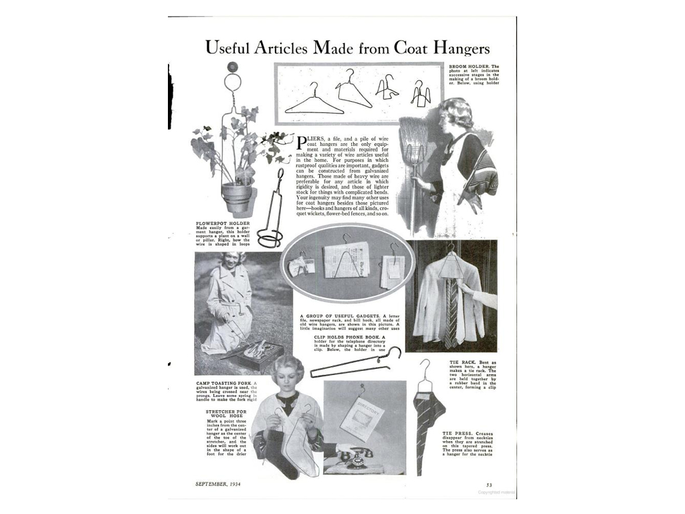
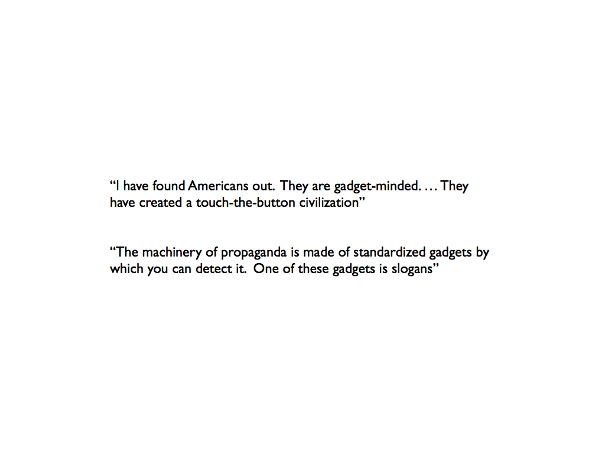
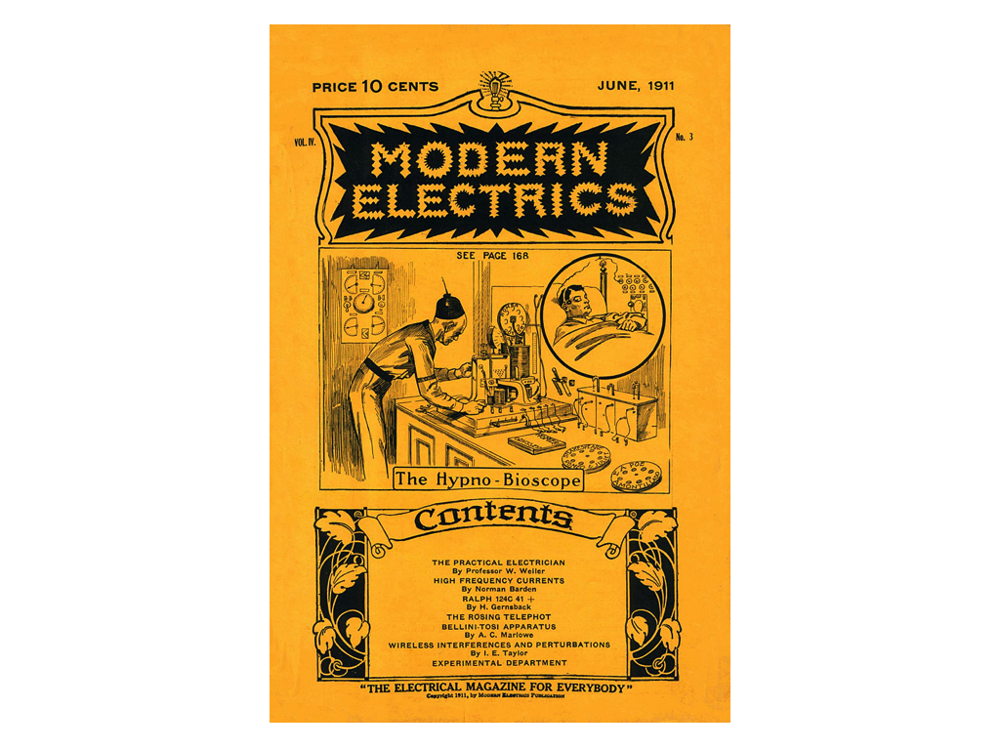

---
title:  From Marlinspike to Mobile Media:\ An Archaeology of the Gadget
author: Grant Wythoff \| Columbia University
date: November 14, 2013
bibliography: /users/grantwythoff/tex/zotero.bib
...

* * * * * *

# Introduction & Overview

apologize for the fact that I can't stay quite as long as we've been used to during these wonderful lunchtime discussions, since soon after this I have to switch gears pretty radically and teach the Book of Genesis… but I'll try to keep my presentation as brief as possible so that we can have enough time for discussion.

As … mentioned, I work in both media studies and the digital humanities -- so I'm interested not only in the ways that we as humanists can study technology, but also, increasingly, how those technologies inflect our methodologies as humanists, simply as part of our research workflows and scholarly communications.

Specifically, my current research is on the ways people think speculatively and creatively through the nature of a particular tool at hand, whether that device is seen to open up new possibilities that weren't there before, or delimit the possible scope of action.

The figure of the *gadget* epitomizes this process for me, being as it is both a kind of functional and fictional device -- but I'll get to that in a bit.  I thought I'd start out with some background and a general overview of the project itself, before moving on to a more historically specific analysis of a group of people who were trying to codify and describe the ways we think creatively through new media technologies.

When I first conceived of this project, I was interested in the historical recurrence of technological fantasies: projections of future worlds and wondrous possibilities tethered to material shifts in the fabric of the everyday present.  It seemed to me that elements of these fantasies lodge themselves in the cultural reception of new media technologies, providing a language by which we can describe and define their contours.

For instance, fantastic stories of physically "jacking in" to cyberspace in the 1980s allowed us to more concretely imagine the decentralized communities of the Internet, just as the figure of the robot became a symbol of automation in the 1940s and 50s.  Similar to research on literary science fiction, my questions would be about the mechanics of this relationship between the real and the imaginary: what elements of the given world are drawn upon, and to what extent must the fantasy resemble the reality for it to work?

From the beginning, I understood that the project had to be something more than a descriptive catalog, merely noting trends in the representation of X new technology in Y body of literature.  It was the more general problematic that I was after, an inquiry into the smallest, most elemental moments in which those fictions are generated.  But the task itself seemed too large.  Without the contours of a specific corpus on the one hand (since speculations on technological futures utterly suffuse culture, from literature to film to journalism to small talk) or on the other hand, the specificity of a particular fantasy (like communion with the dead or virtual reality), it was difficult to know where to begin.

Luckily for me, the years I attended graduate school coincided with the release of the first smartphone, the rise of the tablet as a "third category" of personal computing devices, and the emergence of mobile media that heralded new cultures of play, attention, consumerism, navigation, flirtation, and collaboration (among others).  Over the past decade, gadgets have revolutionized the everyday, seemingly fulfilling some of those old technological fantasies while outstripping others entirely.

These technologies have their own rich history of dreams and anticipations, but to experience them every day is an entirely different matter altogether.  To have your friend present in the form of a soft glow of light emanating from your cupped hands on the subway, to have your location triangulated (actively and passively) by a network of low earth orbit satellites so that you never again have to worry about being lost, all of these things have been imagined before.  But what future do we imagine ourselves ushering in when we use these devices?  And, what use is the history of fictions about ubiquitous connectivity for the way the actual experience feels?

So, my first step was to start taking this keyword "gadget" seriously.  What initially interested me about the gadget is how the word refers to a concrete object you can hold in your hand and at the same time serves as a placeholder, a stand-in for a tool that has been forgotten, rigged up on the fly, or not yet invented. 

Unlike the more dismissive terms "gizmo" or "widget," which denote insignificant variables with no clear operational value, the gadget is an indeterminate device that is nevertheless fully operable in that it fulfills a particular set of technical and narrative functions.  It is an object that lives a curiously double life as both an actual tool and a fictional device. 

What makes the gadget an important and understudied topic in the cultural history of media technologies is the fact that its fundamental instrumentality changes from decade to decade.  Though the word "gadget" is a sort of empty container for any object whatsoever, the shape of that container changes drastically from its origins in late nineteenth century nautical jargon to its present day association with mobile media.  The functionality of the gadget is redefined for the material needs and fictional desires of each new era.

So, to take the bookends in the title of my talk, originally, *gadget* refered to something like this -- the marlinspike, a curved piece of bone or wood used to splice ropes and undo knots.  As a term of nauical jargon, "gadget" refered to anything that had been…

The application of the term gradually shifts to individual cogs within the complex machinery of steam ships, rather than the simple rope, pulley, or implement.

Over the next few decades, the word could refer to specific devices (as the proper name for a wire tying cotton baler, sparking interstate commerce debates in 1905 over the density versus the weight of rail cargo),

categories of devices (for instance as accessories added on to automobiles in the 1900s, airplanes and guns in the 1910s, and gramophones and cameras in the 1920s),

and characteristics of devices (signifying in the 1930s something cobbled together from preexisting materials).

By the end of the 30s, it became possible to speak of the gadget as a mode of thought or a kind of phrase.  

This history of course goes on, leading up to the contemporary connotations of *gadget* as we know it today, but suffice it to say here that

from halyards to pistons to can-openers to pagers, the wager of my dissertation is that by holding all of these diverse instances together as a set, we will be able to track a distinct evolution in the imaginative space between tools and their users.

====

I thought today it would be best to jump into one particular context in which a kind of vocabulary was developed to describe this relationship between tools and their affordances, and that's in early twentieth century amateur experimenter magazines.

One of the historically specific contexts that I explore this nexus of technology and fictional thought is in the origins of American science fiction in electrical experimenter catalogs, a context no one has really looked at.

# Mumford

Founded in 1908, Hugo Gernsback's *Modern Electrics* magazine included an "Experimental Department" in each of its monthly issues, a space for readers to submit their home-brewed designs for novel electric devices.  In the April 1911 issue, Lewis Mumford, author of the now-classic history of media and technology titled *Technics and Civilization*, published his first piece of writing at the age of 15:  a blueprint for a new kind of compact wireless telegraph receiver, described as "a portable wireless outfit, smaller than a small camera, in which sensitiveness is not sacrificed to saving of space."

Flipping back three pages in the same issue, one can find the first installment of the editor Hugo Gernsback's serial novel *Ralph 124C 41+:  A Romance of the Year 2660*, one of the earliest works of modern science fiction.

The proximity of this future media theorist's first piece of published writing to one of the foundational works of science fiction is no coincidence.  Lewis Mumford's early preoccupation as a tinkerer took root in a forum for the exchange of designs, components, and visions of the future.  Mumford, who would go on to have a successful career as a literary critic and associate editor of *The Dial*, among many many other things, cites these experiences among a community of tinkerers in the pages of *Modern Electrics* as foundational for his later theories of what he called technology's "spiritual contribution to our culture."

*Modern Electrics*, which began as a mail-order catalogue for exotic, imported wireless parts, gradually evolved into "A magazine devoted entirely to the Electrical Arts."  The magazine profiled international developments in new media technologies, summarized the latest U.S. Patents awarded to electrical experimenters, and solicited amateur blueprints, designs, and techniques from readers.  What sets *Modern Electrics* apart from other technical publications of the period like *The Wireless Age* and *QST* is the way in which its writers enlisted fiction in their attempts to find a language suited to the analysis of emerging media such as radio, television, or the more exotic osophon and telegraphone.  

For instance, when readers submitting a design encountered difficulties in describing its specifications -- perhaps a certain component was technically or economically unfeasible -- they would stitch their incomplete engineering diagrams together with narrative threads.  In a tradition that continued throughout Gernsback's later publications -- including *Electrical Experimenter, Radio News, Science and Invention,* and most famously, *Amazing Stories* (the first ever science fiction magazine) -- *Modern Electrics* pioneered a kind of writing that combined hard technical description with an openness to the fantastic.  It was a mixture out of which an entire literary genre emerged to tackle the question of the distinctive specificity of "medium" in a new wireless age.

Today, the phrase "science fiction" conjures up images of bug-eyed monsters, ray guns, starships, and sonic screwdrivers.  But in the opening decades of the twentieth century, before a century's accretion of images, narratives, and cliches, that which was not yet called science fiction consisted of a great number of concrete practices all geared toward a reckoning with the technological revolutions in the fabric of everyday life.  "Science," wrote Gernsback in the inaugural issue of *Amazing Stories*,

> through its various branches of mechanics, astronomy, etc., enters so intimately into all our lives today, and we are so much immersed in this science, that we have become rather prone to take new inventions and discoveries for granted.  Our entire mode of living has been changed with the present progress, and it is little wonder, therefore, that many fantastic situations ... are brought about today.  It is in these situations that the new romancers find their great inspiration. ^[@gernsback1927]

For Gernsback, "science" is synonymous with "applied science," an amalgam of science and technology that saw no division between the explanation of complex things and the often fantastic incursion of those things into modern life.  The paradox at the heart of Gernsback's project is that science, that supposed vehicle of enlightenment rationality, can *itself* produce enchantment and wonder.

This is not a perspective unique to Gernsback's emphasis on the *applied* sciences.  As Philip Fisher reminds us, it is often the very act of scientifc explanation that renders the object or phenomenon in question marvelously strange: "every stage of explanation . . . has consistently dispelled the extraordinary only to produce, in the very act of explanation, newer forms of wonder."

Our literary historical challenge in working with this material, then, is to recover the sense of radical openness that greeted not only the basement tinkerer working through the feasibility of transmitting images over a wire, but also the author of "scientifiction" stories (as they called it then) who possessed a highly sophisticated awareness of the fact that . . . 

>Two hundred years ago, stories of this kind were not possible.\
-Gernsback, "A New Sort of Magazine

Often, these individuals were one and the same, weaving together functional and fictional devices in a manner that served for them as a form of scientific discovery in itself.

Today, I will examine the circumstances of science fiction's invention in America.  In contrast to the deeper history of utopias and political satires in the European tradition that would be drawn upon in the twentieth century by H.G. Wells, Olaf Stapledon, Aldous Huxley, and J.G. Ballard, I will argue that science fiction emerged in America as a discourse on media.  While some of the most influential histories of science fiction have subsumed the genre within a larger continuum of utopian literature (as does Frederic Jameson with his emphasis on the transihistorical "desire called utopia"), this approach ends up emphasizing the vast worldbuilding enterprises of the American left (as in Ignatius Donnelly's *Caesar's Column* from 1890 and Edward Bellamy's 1888 record best seller *Looking Backward*), while papering over the smaller-scale, everyday concerns of the technologists and technocrats on the other side of the Atlantic (most notably, Rudyard Kipling).

It also overlooks many of the speculative energies that were both inspired by and reflected in literary productions: cinema, tinkering, popular science, exhibitions, and industrial design.  Setting aside the literary historical syntheses of those science fiction critics looking to elevate the status of the genre by associating it with utopias and political satires, my concerns are quite different.

I'll proceed instead through a speculative question of my own:  what would a literary history constructed from objects look like?  Because the history I have in mind here is not one of *literature* as a body of works but the far more slippery *fiction* as a relation to reality, or what has been called "a form of lived experience," this is not entirely a question of book history, with its emphasis on the material practices and circulation of literature.  In fact, perhaps a shift in emphasis is necessary, from the question of literary history to one of *fictional history.*  In revisiting the genealogy of what Gernsback first christened as "scientifiction," I want to get at the production of those particularly otherworldly moments of everyday life, those moments that seem to extract us from the flow of the ordinary and provide us with a new persepctive on it.

For Michael Wood, fiction can be seen as

> something we find in the slightest hints and verbal gestures of ordinary life, whenever we speak playfully or ironically, or call something by a name that is not its own; whenever we see or say that people and places have markedly changed while stubbornly, loyally remaining the same.

While book history takes up the materiality of literature, the materiality of fiction presents us with some potentially thornier questions.  How are ficitons expressed not only in literary form, but in organizations, plans, engineering diagrams, standards, and physical media machines?  How might we conceptualize or model this moment of exchange between the material and the possible?  Science fiction, a literary genre that emerged out of an electrical parts catalog, provides one starting point for such questions.

I'll proceed by providing, first, a crash course in science fiction studies, for those of you who haven't been lifelong fans, as I have -- what's important for our purposes is to look at some attempts that have been made in the field to account for the genre outside of its literary productions.  Second, we'll move into the specific context of the early 20th century electrical experimenter magazines and their significance as media historical documents.  And finally, I'll say a bit about…

* * * * * *

# Everyday Estrangement

One would be hard pressed to find a formulation in the lexicon of literary criticism that has stood unchallenged longer than Darko Suvin’s definition of science fiction (SF) as the literature of “cognitive estrangement.”  Other useful definitions have certainly emerged from the genre’s authors and critics, but few have proven as rigorous and influential as Suvin’s, and it has held sway over the study of the genre for four decades.

First put forward in “On the Poetics of the Science Fiction Genre” (1972), the phrase “cognitive estrangement” defined the “necessary and sufficient conditions” of a genre

> whose main formal device is an imaginative framework alternative to the author's empirical environment. \[full quote on slide]\

According to this model, science fiction is premised on a process of “estrangement” in that the literary gambit of the individual work consists of a “what if” question directed away from whatever we accept to be this world.  Importantly, this movement away from our world must be “cognitive.”  That is, the fictional hypothesis of the work is elaborated with objective, “scientific” rigor—it has to be plausible.

Pretty basic, formalist stuff, but it’s only now that attacks on this formulation of science fiction’s supposedly defining feature are gaining any traction.  Samuel R. Delany, who questions whether nailing down a concrete definition of science fiction is at all a useful critical endeavor in the first place, was one early detractor of Suvin’s work.  Delany argues that

> the presence and interaction of estrangement and cognition in a literary work are simply and blatantly insufficient to produce SF.  If they interact in one way, they produce fantasy.  If they interact in another, they produce surrealism.  If they interact in still another, they produce criticism.

Contemporary science fiction author China Miéville takes a more pointed approach in his contribution to a recent volume on Marxism in science fiction, drawing attention to the way that cognition in Suvin’s account is premised on an uncritical and monolithic ideal of science.  Miéville writes,

> To the extent that SF claims to be based on ‘science,’ and indeed on what is deemed ‘rationality,’ it is based on capitalist modernity’s ideologically projected self-justification: not some abstract/ideal ‘science,’ but capitalist science’s bullshit about itself.

Suvin's notion of scientific "cognition" thus ignores not only the social construction of what counts as scientific fact, but also the works inspired by the New Wave of 1960s science fiction whose extrapolations proceed not from “science” but conceptions of gender, race, class, psychology, and sexuality.

For other critics, the fact that Suvin focuses only on literary works of science fiction (a model which, furthermore, Suvin himself admits excludes 95% of what is published *as* science fiction) is enough to render his model useless, as it ignores the output of the genre in film, television, comics, performance and visual art, and even some types of critical theory.  Istvan Csicsery-Ronay takes a more catholic approach in his book *The Seven Beauties of Science Fiction* (2008), a catalog of the formal markers native to the genre.  Surveying the many varieties of aesthetic experience science fiction can take up in all of its various media, Csicsery-Ronay even allows for the possibility that science fiction might be seen as a certain modality of lived experience in what he calls our thoroughly “technologized world.”

> The widespread normalization of what is essentially a style of estrangement and dislocation has stimulated the development of science-fictional habits of mind, so that we no longer treat SF as purely a genre-engine producing formulaic effects, but rather as a kind of awareness we might call science-fictionality, a mode of response that frames and tests experiences as if they were aspects of a work of science fiction. . . .  Most people merely bracket difficult-to-process, incongruous moments of technology’s intersection with everyday life as science-fictional moments.

This affective turn toward “science fictionality,” an expansion of the poetics of a literary genre into a category of experience, constitutes one of the more interesting developments in science fiction studies over the past decade or so.  In its simplest formulation, the idea circulates as a truism that “the world finally has caught up with science fiction.”  Many instances of this saying attempt to highlight the way in which the rate of technological change feels like it outpaces any attempt to understand the significance of that incursion in our daily lives.  Others try to come to terms with the fact that many of the genre’s imagined futures never came to pass, as in the popularity of retrofuturist books like *Where’s My Jetpack?* and blogs like Paleofuture, both of which explore how images of futures past sync up with the present in uncanny ways.

Some scholars in science fiction studies encouraged a shift in the field's focus toward the science fictionality of everyday life in order to account for a media historically specific shift.  Brooks Landon, for instance, writes of his

> belief that contemporary electronic technology has so displaced the savor of potentiality from stories about ‘great vistas in time and space’ to ways in which we actually experience time and space anew, that our culture now unconsciously brings to the experience of film and electronic media expectations very similar to those of the traditional SF reader.

For yet another camp of science fiction critics, the experience of science fictionality itself is the product of a postmodern accretion of text upon text to the point that “the literature of the future has a long and honored past,” as Bruce Sterling writes in the preface to his famous anthology of 1980s cyberpunk fiction, *Mirrorshades*: 

> The cyberpunks are perhaps the first SF generation to grow up not only within the literary tradition of science fiction but in a truly science-fictional world.

However, while critical discussions on science fictionality were launched in order to describe certain contours of the contemporary moment, the sense that the world has caught up with its own fantastic dreams is not a recent development.  In other words, everyday forms of estrangement are not specific to the rise of electronic or digital media.  Many film scholars, for instance, have remarked for some time on the inherent science fictionality of *historically* new media, the way, for instance, early cinema realigned audiences' sense of time and space.

This is not just a phenomenological argument.  Tom Gunning describes the “rhetorical tropes and discursive practices” that have benefitted from the valorization of the new in modernity, with its ever-shorter circuits between astonishment and second-nature:

> . . . surprise is learned, fostered and expressed by discursive practices whose implementation brings profit to someone: merchants, policy makers, civic fathers justifying municipal power plants, or any one of a number of interested parties.  Modernity must partly be understood as learning to be surprised by certain innovations, a discourse which valorizes and directs our attention to such changes and the excitement they can provoke.

So the question I'm interested in is what type of literary -- or rather “fictional” history -- would result if this approach to science fiction as a particular form of everyday experience was projected back into a reevaluation of the genre as a whole, rather than confined to a particular historical moment within it.  Instead of understanding “science fictionality” as the product of a postmodern accretion of images and narratives, or as the product of digital media's rise, how might we instead revise our understanding of science fiction’s history so that it might be seen as a structural inheritance of the genre’s very origins?

In looking at the extraliterary history of scientifiction in the early twentieth century, we will want to ask: what were the “rhetorical tropes and discursive practices” of the new drawn upon?  What were the forms of technological experience the genre sought to represent?  And, what kinds of knowledge did such representations enable?

* * * * * *

# Dime Novels & Popular Science

With most critical histories of science fiction focusing on European precursors such as utopian novels, the fantastic journey, and political satire, the dime novel remains one of the most understudied precursors to science fiction.  This is perhaps also the case for the history of American fiction more broadly, considering Bruce Franklin’s influential argument that the dime novel was the dominant literary form in America between the Civil War and World War I.  

While the various types of fiction published in dime novels was too diverse to constitute a genre in and of itself, the reading habits and mode of production that grew up around the dime novels had just as much of an eventual influence on the early twentieth century science fiction magazines as did their subject matter.  In the astute observation of Bill Brown, the dime novel is

>neither a genre per se (like the novel, the romance, the epic) nor simply a subgenre (like the sentimental novel or the detective novel) but rather a subgenre that is inseparable from its systematic modes of production and distribution.

Take for instance this remarkable history of dime novel production published in a 1904 issue of the New York-based little magazine *The Bookman* provides us with a portrait of this distribution, hinting at the idea that it was no coincidence that the dime novel blossomed in popularity the very year that the Civil War erupted:

>dime novels were sent to the army in the field by cords, like unsaved firewood.  Compact in form, they were easily made up into immense bales, and shipped on any kind of freight car, canal-boat or country wagon. 

Brown argues that the serial narrative form that grew out of these pocket-sized books was a primarily technological phenomenon, an integral component in the mass production of dime novels that couldn’t have taken on any other form.  Writing on dime novel Westerns in particular, he continues, “The technology that produced the Western was completed by the narrative technology of the Western itself—a set of interchangeable parts, a standardized structure, and a regularized rhythm of crisis and resolution, event and explanation.”

I want us to hold on to this idea of a sort of assembly-line arrangement between the “fiction factory” production of dime novels (in which one floor would write the stories, another floor would produce illustrations, another floor would print and bind the stories, and finally another floor would tackle marketing and sales), because later magazines would build upon this foundation with the ideal of how magazine circulation operates…

(SLIDE - MAGAZINE FACTORY)

…as we can see in this image, drawn by Gernsback’s most famous illustrator, Frank R. Paul. 

Paul is one of the most influential artists in the history of science fiction graphic art.  Trained as an architect, Paul is best known for his gaudy cover illustrations of grotesque monsters, streamlined vehicles, and dense urban cityscapes.  But his earlier work in Gernsback’s technical publications has been almost forgotten.

Several times in the early Gernsback publications, Paul illustrated the production of the magazines themselves.  (Here the caption reads, “Old Man H.G. and his performing editorial wildcats turning out the monthly Electrical Experimenter spasm.  …AD LIB)

A regular column Paul provided illustrations for was the tongue-in-cheek “Phoney Patent Offizz,” which always contained a series of satirical “inventions” that have just been filed.  

(SLIDE - PHONEY PATENT OFFIZZ)

In the November 1915 issue of *Electrical Experimenter,* Paul depicts a wearable apparatus for the most dedicated of readers, the “bookworm,” that allows him to read in any number of uncommon situations, including while going for long walks at night.  What’s amazing about this illustration is that the bookworm, outfitted with wearable storage bays, a dynamo, umbrella, fan, and electric watch, is depicted reading from an issue of the Deadwood Dick Library, that veritable laboratory for what would later become solidified as the most popular strands of genre fiction later in the century:  mystery, westerns, fantasy, and science fiction.  

The fact that Paul illustrates the bookworm reading *Deadwood Dick* reveals not only an awareness of the genealogy of science fiction (as early as 1915, twelve years before the launch of *Amazing Stories* where most SF critics locate the birth of the genre) but also an idea of the perfect reading subject for this new form of mass produced literature. The ravenous bookworm is completely incorporated into the larger apparatus of pulp magazine production, reading day and night through “an electro-mechanical” series of wearable selenium cells and induction coils.

Gernsback was aware of the dime novel tradition and explicitly built off it in *Amazing Stories,* republishing edisonades like Serviss’s *A Columbus of Space* in the August through September 1926 issues, and deeming Luis Senarens (author of a majority of the Frank Reade titles) to be “the American Jules Verne” in several editorials on the writer.  

The mythology of Edison as a heroic, autonomous inventor inflected discussions of what Gernsback called “scientifiction” as a genre as much as it did the content of those narratives.  Gernsback attempted to frame the writing of scientifiction stories as a kind of tinkering in itself, “suggesting quite bluntly that the writer of SF was engaged in a kind of quasi-scientific enterprise consisting of thought experiments and possibly leading to discoveries.”

This conceptualization of scientifiction as an educational enterprise that engaged both the writer and reader in a series of thought experiments was an important component of Amazing Stories.  In the now famous editorial introduction to the magazine’s inaugural issue, titled “A New Sort of Magazine,” he writes that scientifiction stories “supply knowledge that we might not otherwise obtain—and they supply it in a very palatable form.  For the best of these modern writers of scientifiction have the knack of imparting knowledge, and even inspiration, without once making us aware that we are being taught.”

(SLIDE - EE COVERS)

The way in which new technologies and innovations were described in these serial novels and stories was meant not only to amaze but to provide “knowledge” of their significance.  One of the questions I’m interested in here, is what happens to technology when we understand it not through a scientific explanation of how it works, through its technical specificities or engineering makeup, but through a kind of outright wonder in the face of countless new possibilities laid out before us?

(EE COVERS)

In writing on the effect of “wonder,” Tom Gunning argues that “A discourse of wonder draws our attention to new technology, not simply as a tool, but precisely as a spectacle, less as something that performs a useful task than as something which astounds us by performing in a way that seemed unlikely or magical before.”  

In the science magazines, the relationship between wonder and knowledge was brought into question, precisely through new technical objects that challenged conventional modes of understanding.

* * * * * *

# Popular Iconography of Possible Media

In the Gernsback publications, the technical capabilities of a given device was always less important than what that device implied.  Sometimes, these implications would simply take the form of overblown statistics, as it did for the Telimco, a set “guaranteed to work up to one mile” that in actuality could have had a range of no more than 300-500 feet and whose untuned circuits “must have caused extensive interference to any nearby stations.”  Other times, the writers in the Gernsback publications would follow reports on the latest electrical research and development through to their logical conclusions.  For instance, the concept of transmitting images across a wire isn’t fully articulated by what’s at hand (selenium cell scanning) until certain projected functionalities are built into the apparatus (multiplexed signals and faster image refresh rate, both of which were impossible at the time).

Unlike other technical publications that just reported on the latest electrical R&D, Gernsback and his writers would follow such developments through to their logical conclusions, locating the material conditions of possibility under which a new signal processing technique might be scaled up into an entire medium.  As some of Gernsback’s detractors in science fiction studies are fond of pointing out, advertising rhetoric and speculative fictions operated side by side in the Gernsback magazines.  But in both modes, one finds that depicting a certain gadget means locating the inherence of an entirely new form of communication.

Regardless of how advanced the devices detailed in the pages of Gernsback’s electrical experimenter magazines seemed—solar cells, automobile mounted radiotelephones, electric keyboards powered by vacuum tubes—his staff reported on them as if they only required a combination of already existing electrical principles and components.  These new media appear as little more than the sum of individual building blocks that one can pick and choose from out of the pages of the *Electro Importing Catalog*.  Technical literacy was encouraged not only through blueprints and instruction manuals for the amateur tinkerer, but also through thought experiments and graphical projections of what these new media might look like.

The May 1927 cover of *Radio News* portrays a woman sitting next to a television receiver, or more precisely, a mockup of what such a receiver might eventually look like.  The caption asks readers to judge “What’s wrong with this picture?” and send in their answers for the chance to win $300 (possible answers: a single colorized element in an otherwise black and white image; the clock in the broadcasted image displays a different time than that on the wall of the viewer; a transparent screen).  Such a challenge doesn’t require a working knowledge of how to construct a prototype of a television set or read a circuit diagram of how it is to be wired.  Instead, it encourages the viewer to participate in a kind of thought experiment about how something like television might one day function as a part of the furniture of everyday life.

The shape of media to come took on an iconography all its own through the illustrations of Frank R. Paul.  Paul’s depictions of gadgetry circulated widely beyond their original publication venues in a way that has never before been given any attention.  Plans for the osophon, a device Gernsback designed to replace headphones by transmitting sound through vibrations in the jawbone of the listener, were published and reviewed in the German journal *Der Radio-Amateur.*  Paul’s sketch of a man using a tuning fork to calibrate the speed of the 1928 *Science and Invention* Nipkow disk television receiver was republished the following year in the Chinese film journal *Shadow Play Magazine* as an illustration of recent research into television, what was referred to in the article as, directly translated, “wireless cinema.”

According to Weihong Bao, this article surveys recent inventions in cinema and

> clearly highlights this convertibility and malleability of media (telephone, telegraph, radio, television; plus, sound and color film).  Television was introduced as one of the inventions ‘in the film world’ but the author simultaneously associated it with his childhood fantasy, seeing television as an extension of the telephone, no combining wireless technology and cinema.

This is something I've had to table at the moment simply because the project is getting so large, but further research into the global circulation of these images could reveal what we might think of as an emergent, transnational media culture in the early 20th century that thrived off discussions of recombinant media technologies and dreams of a media saturated future.

This popular iconography of possible media, at once legible to the non-expert and open to an informed conversation on how these things of the future might function, was part of a wider culture of devising a language for new media, and provided one of the foundational strands of a science fiction genre.  If not in actual practice, there was a real energy behind the fictive swapping out of components from a given device and remixing them or replacing them with parts that had not yet come into being.  This was a moment of media alchemy, when one needed only to mash up two existing devices or components to imagine the next fantastic advance—for instance the radiophone as a combination of wireless telegraphy and telephony, or the “telephot” as a combination of photography and telephony.

The emphasis in the Gernsback magazines focused not only on the level of the device itself, but also on the kinds of sensory effects that would result from these new combinations, recalling what John Johnston, drawing on Friedrich Kittler calls “partially connected media systems” that interface “a diversity of information and effects.”  For Gernsback’s Electro Importing Company and Experimenter Publishing Company, this modularity was a product of both technical experimentation and a popular means of imagining such hybrid media.  On the one hand, experiments were conducted and reported on at Gernsback’s radio station WRNY with broadcast media and the effects of various instruments and signal processing techniques on the auditory perception of the station’s listeners.  On the other hand, articles and editorials in the magazines would often draw on simple analogies to describe these effects, such as the explanation that “television does for the eye what the telephone does for the ear,” as Gernsback put it, lifting a slightly altered version of the now famous language from Edison’s patent for the kinetoscope, which does for the eye what the phonograph does for the ear.

While television was a real, if not improbable prospect for the work of the basement experimenter, there were other devices Gernsback and his staff reported on that thrived entirely off of the incorporation of projected functionalities not yet within the realm of possibility.  For instance, mobility is often added on to the end of articles covering other innovations or proposed devices to further articulate their potential as a new means of communication or information delivery, a technique we saw in the early reception of wireless telegraphy.  In an Electrical Experimenter article on the “newsophone,” a system in which users call a central telephone exchange that connects them to phonograph recordings of the latest news, the prospect of receiving this information on the go is floated at the article’s close.

> A great dream of the future, which we would like to mention here so that it goes on record, and which most probably the readers of this article will live to see before a great while, is the radio distribution of news by central news agencies in the larger cities, to thousands of radio stations in all parts of the world.  Then any one can simply ‘listen in’ on their pocket wireless set, connected to the nearest metal body such as a radiator, iron bed or umbrella, and receive the ‘Latest News.’

This kind of modularity among actual, proposed, and imagined components of speculative media is characteristic of the coverage of both real and imagined devices, both of which were treated as speculative apparatuses for future improvement.

Coming from this angle to the first works of narrative science fiction that emerged in these magazines, it’s striking just how seamless the transition is from technical experimentation to narrative speculation.  While most science fiction critics’ attention to the early Gernsback confines itself to the serialized publication of his novel Ralph 124C 41+ in the April 1911 issue of *Modern Electrics*, the generative “what if” questions of science fictional worlds were already very much at work in the experimenter magazines all the way back to their catalog origins.  Science fiction wasn’t just a narrative phenomenon, it was a mode of technical interaction.

# Gesture Toward the Present & Digital Gadgetry

Is digital media fundamentally altering the ways we think, read, communicate, write?  This is not a new sentiment, and in the electrical experimenter magazines we see a means of coming to terms with these revelations/revolutions.

We should remember this -- a new kind of technical literacy might be borne out of it.

Revisit "interaction," technique/technology, etc.

* * *

As Tom Gunning writes, “the cycle from wonder to habit need not run only one way.”

Critique of Balsamo on humanists studying the cultural imaginary of technology? (from defense)

This last decade has seen the release of the first smartphone, the rise of the tablet as a "third cateogry" of personal computing devices, and the emergence of mobile media that heralded new cultures of play, attention, consumerism, navigation, flirtation, and collaboration (among others).  Gadgets have seemingly revolutionized the everyday, fulfilling scores of old technological fantasies while outstripping others entirely.

This is not merely of historical interest, precisely because we need to revisit the humanistic dimensions, the *techniques* that are rightly the province of the humanities.

And yet on another level, there is something to the idea that an encounter with a new technology causes an immediate reorientation in the ways we make sense of the world.  The technophiles of today frequently remark that touching the latest Apple product is like "holding the future in your hands,"

as if the iPhone were the next iteration of the *2001: A Space Odyssey* monolith: a sleek black box whose inner workings we couldn't possibly understand but at the same time, somehow, makes us smarter the instant we touch it.  In this mythical explanation of human origins that falls into the gap of Kubrick's famous match cut from the bone club thrown into the air to the spaceship gracefully floating through outer space, we are simply remade by the tool the moment what might be done with it becomes clear.