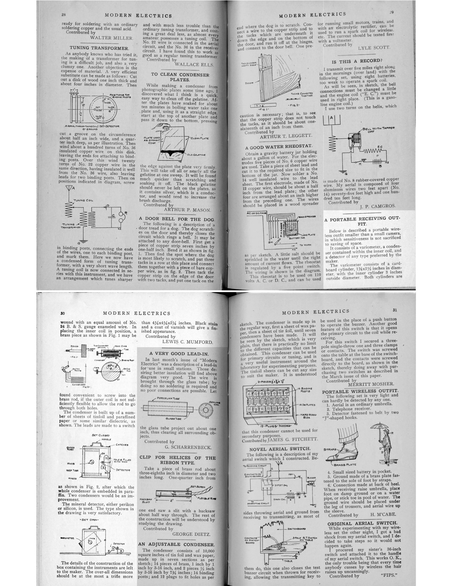
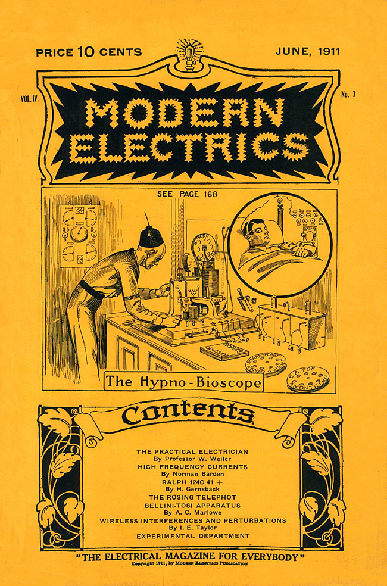

---
title:  From Marlinspike to Mobile Media:\ An Archaeology of the Gadget
author: Grant Wythoff \| Columbia University
date: November 14, 2013
bibliography: /users/grantwythoff/tex/zotero.bib
...

* * * * * *

# Introduction & Overview

As Holger mentioned, I work in both media studies and the digital humanities -- which means that I'm interested not only in the ways that we as humanists can study technology, but also, increasingly, how those technologies inflect our methodologies as humanists, simply as part of our research workflows and scholarly communications.

Specifically, my current book project, titled *Gadgetry: New Media and the Fictional Imagination* is about the ways people imagine what can be done with a given technology.  This includes everything from the macro level of new cultural forms and practices that emerge from mass media, down to the micro level of the individual user picking up a tool and thinking through what can be done with it, what that tool makes possible that wasn't before.  For me, the figure of the gadget, refering to both specific and fictional tools, crystallizes this relationship between technology and the imagination.

When I first conceived of this project, I was interested very broadly in the historical recurrence of technological fantasies: projections of future worlds and wondrous possibilities tethered to material shifts in the fabric of the everyday present.  It seemed to me that elements of these fantasies lodge themselves in the cultural reception of new media technologies, providing a language by which we can describe and define their contours.

For instance, fantastic stories of physically "jacking in" to cyberspace in the 1980s allowed us to more concretely imagine the decentralized communities of the Internet (AD LIB, concensual hallucination, William Gibson *Neuromancer*)

In the same way, the figure of the robot became a symbol of automation in the 1940s and 50s, personifying the still unfamiliar technology of the computer.  Similar to research on literary science fiction, my questions would be about the mechanics of this relationship between the real and the imaginary: what elements of the given world are drawn upon, and to what extent must the fantasy resemble the reality for it to work?

From the beginning, I understood that the project had to be something more than a descriptive catalog, merely noting trends in the representation of X new technology in Y body of literature.  It was the more general problematic that I was after, an inquiry into the smallest, most elemental moments in which those fictions are generated.  But the task itself seemed too large.  Without the contours of a specific corpus on the one hand (since speculations on technological futures utterly suffuse culture, from literature to film to journalism to small talk) or on the other hand, the specificity of a particular fantasy (like communion with the dead or virtual reality), it was difficult to know where to begin.

Luckily for me, the years I've been working on this project have coincided with the release of the first smartphone, the rise of the tablet as a "third category" of personal computing devices, and the emergence of mobile media that heralded new cultures of play, attention, consumerism, navigation, flirtation, and collaboration (among others).  Over the past decade, gadgets have revolutionized the everyday, seemingly fulfilling some of those old technological fantasies while outstripping others entirely.

These technologies have their own rich history of dreams and anticipations, but to experience them every day is an entirely different matter altogether.  To have your friend present in the form of a soft glow of light emanating from your cupped hands on the subway, to have your location triangulated (both with and without your knowledge) by a network of low earth orbit satellites so that you never again have to worry about being lost, all of these things have been imagined before.  But what future do we imagine ourselves ushering in when we use these devices?  And, what use is the history of fictions about ubiquitous connectivity for the way the actual experience feels?

So, my first step was to start taking the keyword "gadget" seriously.  What initially interested me about the gadget is how the word refers to a concrete object you can hold in your hand and at the same time serves as a placeholder, a stand-in for a tool that has been forgotten, rigged up on the fly, or not yet invented.

Unlike the more dismissive terms "gizmo" or "widget," which denote insignificant variables with no clear operational value, the gadget is an indeterminate device that is nevertheless fully operable in that it fulfills a particular set of technical and narrative functions.  It is an object that lives a curiously double life as both an actual tool and a fictional device. 

What makes the gadget an important and understudied topic in the cultural history of media technologies is the fact that its fundamental instrumentality changes from decade to decade.  Though the word "gadget" is a sort of empty container for any object whatsoever, the shape of that container changes drastically from its origins in late nineteenth century nautical jargon to its present day association with mobile media.  The functionality of the gadget is redefined for the material needs and fictional desires of each new era.

Originating among sailors in the 1850s, the word *gadget* was a term of nautical jargon, serving as a placeholder for the name of any object on board a ship that had slipped from memory.  The marlinspike was one such tool, a curved piece of bone or wood used to splice ropes and undo knots, and the gadget *par excellence* for sailors who valued simple tools with a huge range of applications.

The deceivingly simple nautical origins of the gadget as a generic name for anything in fact already contained some of the complexities that would provide the word such a wide applicability throughout the twentieth century.  For instance, there's a lot of wonderful material in nautical handbooks debating terminology and organizing entire lexicons of object babble according to priority of use and usability.  One recommends, for instance, that "*gilhickey* should only ever used to distinguish one gadget from another.  The first gadget is the gadget.  The second gadget in any situation in which two appear is the gilhickey."

Other times, rather than simply referring to a particular object, gadget might imply a particular style of performing an action -- in this nautical setting, usually through economy of means, using the simplest technique for achieving the most effective result -- although more styles of performing tasks will surface later in the word’s history.  At times, it becomes unclear whether the gadget is the tool used to perform an action, or the technique of performing that action itself.  Thus *gadget* might also imply a form of knowing that is related but not reducible to the tools required to accomplish a particular task.  In other words, it’s not only a question of tools, but sufficient training or expertise in their applications.

It's precisely this plasticity of the gadget that allows it to quickly migrate into a number of other contexts.  As the nineteenth century comes to a close, the application of the term begins to shift to the individual cogs or elements within the complex machinery of steam ships, rather than the simple rope, pulley, or implement aboard sailing ships.  

Over the next few decades, the word began to refer to specific devices:  for instance as the proper name for a wire tying cotton baler, sparking interstate commerce debates in 1905 over the density versus the weight of rail cargo; or, as the name for a coupling mechanism that quickly and easily connected massive underground tunnel segments to a crane, doing away with the need for hundreds of thousands of cast iron lugs during the 1909 construction of the East River Tunnel in New York, connecting Penn Station to Long Island City.

In the 1910s, *gadget* becomes associated with modifications, improvements, and additions to existing technical systems, rather than new devices constructed whole cloth.  These modifications tend to cluster around airplanes and guns in the 1910s, automobiles in the 1920s, and gramophones and cameras by the 1930s.

To give you one example, debates over the merits of gadgetry among automobile engineers and designers focused on the importance of the information that new kinds of dashboard gauges displayed for the driver, questioning whether it was trivial to know, for instance, the top speed of an automobile over the course of a trip, the precise water temperature circulating through the engine, or each tire's pressure.  Uses like this begin to shift the emphasis away from the physicality of the gadget, giving equal importance to the legibility and necessity of the data it provides, a movement away from the tool itself and toward what it communicates.

Later, *gadget* can refer to characteristics of devices, signifying by the 1930s something cobbled together from preexisting, household materials.  A 1930 magazine article on innovation in the domestic sphere argues that "women . . . have the advantage over men of knowing what is wanted in the sphere of domestic inventions.  Every housewife is an inventor, because almost every day of her life, she is making something new or devising some gadget.”  Multiple-page photo spreads in popular magazines would be devoted to the construction of these devices, promising that workflows previously requiring a great amount of attention or labor could be economized through improvised material expedients, like a curved and flattened knife tip for removing newspaper wrappers; slices of rubber tubing pulled over a dog’s nails to prevent scratching; or impromptu pliers made out of metal coat hangers.

> [**SLIDE**]
> "I have found Americans out. They are gadget-minded. They have created a touch-the-button civilization."\
> -Joseph Fort Newton, 1937

> "The machinery of propaganda is made of standardized gadgets by which you can detect it. One of these gadgets is slogans."\
> -Herbert Hoover, 1949

By the end of the 30s, it became possible to speak of the gadget as a mode of thought or a kind of phrase.  Public opinion polls were referred to as “social gadgets,” honest debate was understood to be free of any, and The New Deal was depicted as a collection of interlocking gadgets to solve a massive economic crisis.  Gadget had outgrown its primarily technical heritage, with derivatives beginning to emerge like gadget idea, gadget-minded, and gadgeteer.

This history of course goes on, leading up to the contemporary connotations of the word as we know it today -- related to digital media and mobile devices -- but suffice it to say here that

from halyards to pistons to can-openers to walkie-talkies, the wager of this project is that by holding all of these diverse instances together as a set, we will be able to track a distinct evolution in the imaginative space between tools and their users.  While gadgets are usually passed over in the history of technology as trivial outliers, I argue the contrary throughout my book:  that they represent elemental moments in which we, as users of technology who negotiate a unique and intensely personal *syntax* with our tools, tacitly debate the merits of usefulness and sheer aesthetic pleasure, handmade and industrially produced expedients, consumer desire and cultural production.

# Overview (w/ slide)

I thought today it would be best to explore one historically specific context in which a group of people tried to codify and describe the relationship between tools and their affordances, and that's in early twentieth century magazines made for amateur experimenters -- basically companion pieces and community forums for people tinkering with home-brewed radio sets and prototype televisions around 1910.  These magazines ended up publishing some of the earliest works of modern science fiction -- which was referred to then as "scientifiction" -- and it's the relationship between tinkering and literary form in these publications that I'd like to focus on for the remainder of my talk.

# Mumford

Founded in 1908, Hugo Gernsback's *Modern Electrics* magazine published an "Experimental Department" in each of its monthly issues, a space for readers to submit their home-brewed designs for novel electric devices.  In the April 1911 issue, Lewis Mumford, author of the now-classic history of media and technology titled *Technics and Civilization*, published his first piece of writing at the age of 15:  a blueprint for a new kind of compact wireless telegraph receiver, described as "a portable wireless outfit, smaller than a small camera, in which sensitiveness is not sacrificed to saving of space."

Flipping back three pages in the same issue, one can find the first installment of the editor Hugo Gernsback's serial novel *Ralph 124C 41+:  A Romance of the Year 2660*, one of the earliest works of modern science fiction.

The proximity of this future media theorist's first piece of published writing to one of the foundational works of science fiction is no coincidence.  Lewis Mumford's early preoccupation as a tinkerer took root in a forum for the exchange of designs, components, and visions of the future.  Mumford, who would go on to have a successful career as, among many many other things, a literary critic and associate editor of *The Dial*, cites these experiences among a community of tinkerers in the pages of *Modern Electrics* as foundational for his later theories of what he called technology's "spiritual contribution to our culture."

*Modern Electrics*, which began as a mail-order catalogue for exotic, imported wireless parts, gradually evolved into "A magazine devoted entirely to the Electrical Arts."  The magazine profiled international developments in new media technologies, summarized the latest U.S. Patents awarded to electrical experimenters, and solicited amateur blueprints, designs, and techniques from readers.  What sets *Modern Electrics* apart from other technical publications of the period like *The Wireless Age* and *QST* is the way in which its writers enlisted fiction in their attempts to find a language suited to the analysis of emerging media such as radio, television, or the more exotic osophone and telegraphone.  

For instance, when readers submitting a design encountered difficulties in describing its specifications -- perhaps a certain component was technically or economically unfeasible -- they would stitch their incomplete engineering diagrams together with narrative threads.  In a tradition that continued throughout Gernsback's later publications -- including *Electrical Experimenter, Radio News, Science and Invention,* and most famously, *Amazing Stories* (the first ever science fiction magazine) -- *Modern Electrics* pioneered a kind of writing that combined hard technical description with an openness to the fantastic.  It was a mixture out of which an entire literary genre emerged to tackle the question of the distinctive specificity of "medium" in a new wireless age.

Today, the phrase "science fiction" conjures up images of bug-eyed monsters, ray guns, starships, and sonic screwdrivers.  But in the opening decades of the twentieth century, before a century's accretion of images, narratives, and cliches, that which was not yet called science fiction consisted of a great number of concrete practices all geared toward a reckoning with the technological revolutions in everyday life.  "Science," wrote Gernsback in the inaugural issue of *Amazing Stories*,

> through its various branches of mechanics, astronomy, etc., enters so intimately into all our lives today, and we are so much immersed in this science, that we have become rather prone to take new inventions and discoveries for granted.  Our entire mode of living has been changed with the present progress, and it is little wonder, therefore, that many fantastic situations ... are brought about today.  It is in these situations that the new romancers find their great inspiration.

For Gernsback, "science" is synonymous with "applied science," an amalgam of science and technology that saw no division between the explanation of complex things and the often fantastic incursion of those things into modern life.  The paradox at the heart of Gernsback's project is that science, that supposed vehicle of enlightenment rationality, can *itself* produce enchantment and wonder.

This is not a perspective unique to Gernsback's emphasis on the *applied* sciences.  As Philip Fisher reminds us, it is often the very act of scientifc explanation that renders the object or phenomenon in question marvelously strange.  He writes, "every stage of explanation . . . has consistently dispelled the extraordinary only to produce, in the very act of explanation, newer forms of wonder."

Our literary historical challenge in working with this material, then, is to recover the sense of radical openness that greeted not only the basement tinkerer working through the feasibility of transmitting images over a wire, but also the author of "scientifiction" stories (as they called it then) who possessed a highly sophisticated awareness of the fact that . . . 

>Two hundred years ago, stories of this kind were not possible.\
-Gernsback, "A New Sort of Magazine

Often, these individuals were one and the same, weaving together functional and fictional devices in a manner that served for them as a form of scientific discovery in itself.

[**MUTE**]

Today, I will examine the circumstances of science fiction's invention in America.  In contrast to the deeper history of utopias and political satires in the European tradition that would be drawn upon in the twentieth century by H.G. Wells, Olaf Stapledon, Aldous Huxley, and J.G. Ballard, I will argue that science fiction emerged in America as a discourse on media.  While some of the most influential histories of science fiction have subsumed the genre within a larger continuum of utopian literature (as does Frederic Jameson with his emphasis on the transihistorical "desire called utopia"), this approach ends up emphasizing the vast worldbuilding enterprises of the American left (as in Ignatius Donnelly's *Caesar's Column* from 1890 and Edward Bellamy's 1888 record best seller *Looking Backward*), while papering over the smaller-scale, everyday concerns of the technologists and technocrats on the other side of the Atlantic (most notably, Rudyard Kipling).

It also overlooks many of the speculative energies that were both inspired by and reflected in literary productions: cinema, tinkering, popular science, exhibitions, and industrial design.  Setting aside the literary historical syntheses of those science fiction critics looking to elevate the status of the genre by associating it with utopias and political satires, my concerns are quite different.

I'll proceed instead through a speculative question of my own:  what would a literary history constructed from objects look like?  Because the history I have in mind here is not one of *literature* as a body of works but the far more slippery *fiction* as a relation to reality, or what has even been called "a form of lived experience," this is not entirely a question of book history, with its emphasis on the material practices and circulation of literature.  In fact, perhaps a shift in emphasis is necessary, from the question of literary history to one of *fictional history.*  In revisiting the genealogy of what Gernsback first christened as "scientifiction," I want to get at the production of those particularly otherworldly moments of everyday life, those moments that seem to extract us from the flow of the ordinary and provide us with a new persepctive on it.

For Michael Wood, fiction can be seen as

> something we find in the slightest hints and verbal gestures of ordinary life, whenever we speak playfully or ironically, or call something by a name that is not its own; whenever we see or say that people and places have markedly changed while stubbornly, loyally remaining the same.

While book history takes up the materiality of literature, the materiality of fiction presents us with some potentially thornier questions.  How are ficitons expressed not only in literary form, but in organizations, plans, engineering diagrams, standards, and physical media machines?  How might we conceptualize or model this moment of exchange between the material and the possible?  Science fiction, a literary genre that emerged out of an electrical parts catalog, provides one starting point for such questions.

I'll proceed by providing, first, a crash course in science fiction studies, for those of you who haven't been lifelong fans, as I have.  What's important for our purposes is to look at some attempts that have been made in the field to account for the genre outside of its literary productions.  Second, we'll take a look at some of those early 20th century electrical experimenter magazines and their significance as media historical documents.  And finally, I'll say a bit about what makes this moment interesting for contemporary conversations on gadgetry.  [WATER]

* * * * * *

# Everyday Estrangement

One would be hard pressed to find a formulation in the lexicon of literary criticism that has stood unchallenged longer than Darko Suvin’s definition of science fiction (SF) as the literature of “cognitive estrangement.”  Other useful definitions have certainly emerged from the genre’s authors and critics, but few have proven as rigorous and influential as Suvin’s, and it has held sway over the study of the genre for four decades.

First put forward in “On the Poetics of the Science Fiction Genre” (1972), the phrase “cognitive estrangement” defined the “necessary and sufficient conditions” of a genre

> [**QUOTE**] whose main formal device is an imaginative framework alternative to the author's empirical environment.

According to this model, science fiction is premised on a process of “estrangement” in that the literary gambit of the individual work consists of a “what if” question directed away from whatever we accept to be this world.  Importantly, this movement away from our world must be “cognitive.”  That is, the fictional hypothesis of the work is elaborated with objective, “scientific” rigor—it has to be plausible.

Pretty basic, formalist stuff, but it’s only now that attacks on this formulation of science fiction’s supposedly defining feature are gaining any traction.  Samuel R. Delany, who questions whether nailing down a concrete definition of science fiction is at all a useful critical endeavor in the first place, was one early detractor of Suvin’s work.  Delany argues that

> the presence and interaction of estrangement and cognition in a literary work are simply and blatantly insufficient to produce SF.  If they interact in one way, they produce fantasy.  If they interact in another, they produce surrealism.  If they interact in still another, they produce criticism.

Contemporary science fiction author China Miéville takes a more pointed approach in his contribution to a recent volume on Marxism in science fiction, drawing attention to the way that cognition in Suvin’s account is premised on an uncritical and monolithic ideal of science.  Miéville writes,

> To the extent that SF claims to be based on ‘science,’ and indeed on what is deemed ‘rationality,’ it is based on capitalist modernity’s ideologically projected self-justification: not some abstract/ideal ‘science,’ but [apologies] capitalist science’s bullshit about itself.

Suvin's notion of scientific "cognition" thus ignores not only the social construction of what counts as scientific fact, but also the works inspired by the New Wave of 1960s science fiction whose extrapolations proceed not from “science” but conceptions of gender, race, class, psychology, and sexuality.

[**MUTE**]

For other critics, the fact that Suvin focuses only on literary works of science fiction (a model which, furthermore, Suvin himself admits excludes 95% of what is published *as* science fiction) is enough to render his model useless, as it ignores the output of the genre in film, television, comics, performance and visual art, and even some types of critical theory.  Istvan Csicsery-Ronay takes a more catholic approach in his book *The Seven Beauties of Science Fiction* (2008), a catalog of the formal markers native to the genre.  Surveying the many varieties of aesthetic experience science fiction can take up in all of its various media, Csicsery-Ronay even allows for the possibility that science fiction might be seen as a certain modality of lived experience in what he calls our thoroughly “technologized world.”

> [**QUOTE**] The widespread normalization of what is essentially a style of estrangement and dislocation has stimulated the development of science-fictional habits of mind, so that we no longer treat SF as purely a genre-engine producing formulaic effects, but rather as a kind of awareness we might call science-fictionality, a mode of response that frames and tests experiences as if they were aspects of a work of science fiction. . . .  Most people merely bracket difficult-to-process, incongruous moments of technology’s intersection with everyday life as science-fictional moments. [**ENDQUOTE**]

This affective turn toward “science fictionality,” an expansion of the poetics of a literary genre into a category of experience, constitutes one of the more interesting developments in science fiction studies over the past decade or so.  In its simplest formulation, the idea circulates as a truism that “the world finally has caught up with science fiction.”  Many instances of this saying attempt to highlight the way in which the rate of technological change feels like it outpaces any attempt to understand the significance of that incursion in our daily lives.  Others try to come to terms with the fact that many of the genre’s imagined futures never came to pass, as in the popularity of retrofuturist books like *Where’s My Jetpack?* and blogs like Paleofuture, both of which explore how images of futures past sync up with the present in uncanny ways.

Some scholars in science fiction studies encouraged a shift in the field's focus toward science fictionality in order to account for a media historically specific shift.  Brooks Landon, for instance, writes of his

> [**QUOTE**] belief that contemporary electronic technology has so displaced the savor of potentiality from stories about ‘great vistas in time and space’ to ways in which we actually experience time and space anew, that our culture now unconsciously brings to the experience of film and electronic media expectations very similar to those of the traditional SF reader.

For yet another camp of science fiction critics, the experience of science fictionality itself is the product of a postmodern accretion of text upon text to the point that “the literature of the future has a long and honored past,” as Bruce Sterling writes in the preface to his famous anthology of 1980s cyberpunk fiction, *Mirrorshades*: 

> The cyberpunks are perhaps the first SF generation to grow up not only within the literary tradition of science fiction but in a truly science-fictional world.

However, while critical discussions on science fictionality were launched in order to describe certain contours of the contemporary moment, the sense that the world has caught up with its own fantastic dreams is not a recent development.  In other words, everyday forms of estrangement are not specific to the rise of electronic or digital media.  Many film scholars, for instance, have remarked for some time on the inherent science fictionality of *historically* new media, the way, for instance, early cinema realigned audiences' sense of time and space.

This is not just a phenomenological argument.  Tom Gunning describes the valorization of the new in modernity, with its ever-shorter circuits between astonishment and second-nature:

> . . . surprise is learned, fostered and expressed by discursive practices whose implementation brings profit to someone: merchants, policy makers, civic fathers justifying municipal power plants, or any one of a number of interested parties.  Modernity must partly be understood as learning to be surprised by certain innovations, a discourse which valorizes and directs our attention to such changes and the excitement they can provoke.

So the question I'm interested in is what type of literary -- or rather “fictional” history -- would result if this approach to science fiction as a particular form of everyday experience was projected back into a reevaluation of the genre as a whole, rather than confined to a particular historical moment within it.  Instead of understanding “science fictionality” as the product of a postmodern accretion of images and narratives, or as the product of digital media's rise, how might we instead revise our understanding of science fiction’s history so that it might be seen as a structural inheritance of the genre’s very origins?

In looking at the extraliterary history of scientifiction in the early twentieth century, this means asking: what were the “rhetorical tropes and discursive practices” of the new drawn upon?  What were the forms of technological experience the genre sought to represent?  And, what kinds of knowledge did such representations enable?

* * * * * *

# The Popular Iconography of Possible Media

So let's come back to *Modern Electrics* magazine.  *Modern Electrics* began as the mail-order catalogue for Hugo Gernsback's Electro Importing Company, founded in 1905.  Through this catalog and their retail store at Broadway and Chambers St. in downtown New York (TriBeCa), the company provided access to specialized wireless and electrical equipment not found anywhere outside of Europe.  Electro Importing catered to a diverse clientele, providing their more advanced basement experimenters with the first vacuum tube offered for sale to the general public in 1911, and manufacturing for their novice users the first fully assembled radio set commercially available in late 1905, the Telimco.

After several issues of their mail order catalog and a growing subscription list, Electro Importing began including features, editorials, and letters to the editor.  Between 1906 and 1910, the catalog grew into a series of monthly magazines for the wireless homebrewer, beginning with *Modern Electrics* in 1908 and the offshoot Experimenter Publishing Company in 1915.  The transition from the mail-order catalog to the ‘slick paper’ monthly magazine format was a smooth one, evidenced by the fact that the third edition (1908) of the Electro Importing catalog bears the title of the new full-format magazine, “Modern Electrics.”  While the magazine still advertised the equipment Electro Importing offered for sale in a familiar grid layout with ordering instructions, it also included feature articles detailing the latest research into experimental media technologies in America, Germany, France, and in Gernsback’s own company offices.  Regular reporters like H. Winfield Secor and René Homer, celebrity guest contributors such as Lee De Forest, Thomas Edison, and Nikola Tesla, as well as the unnamed Paris Correspondent and Berlin Correspondent provided reports on television, wireless telephony, and the use of novel electrical apparatuses in film and theatrical productions, each of which would go into a great degree of technical detail.

But the hallmark of the magazine became its more speculative articles, those that were willing to extrapolate fantastic scenarios out of the technical details at hand.  The first published in this vein was “Harnessing the Ocean,” a boosterish piece in the December 1908 issue claiming that “electricity is the fuel of the future,” provided we can find a way to convert the earth’s tides into electric power.

Six months later, Gernsback wrote an article on what would become one of his favorite topics over the next few decades, “Signaling to Mars,” which detailed the conditions that would have to obtain in order for Earth to send messages via wireless telegraph to the red planet.  The quantitative description of the transmitting apparatus in terms of its necessary output and best time of year to signal only constitutes one aspect of this scenario.  Gernsback goes on to take into account the nature of Martian intelligence that would be necessary for such a communicative circuit to be completed:

> we can only hope that the Martians are further advanced than we and may signal back to us, using a method new to us and possibly long discarded by them, when thousands of years ago they stopped signaling to us, and gave us up, as we did not have intelligence enough to understand.

For the readers of *Modern Electrics*, the technical context in which this highly speculative article appeared only lent credence to the idea that first contact was right around the corner.  In the copy of this issue at Princeton University’s Firestone Library, someone inserted a newspaper clipping (now a permanently affixed leaf within the bound volume) that tells of a new distance record for wireless signaling, from San Francisco to the Pacific Mail Line steamship Korea as it made its way across the ocean.

Left there as if to vouch for the plausibility of the idea that we’ll soon be able to connect with our nearest planetary neighbor, the clipping provides a wonderful sense of how it was people read these magazines.  Though the Gernsback titles eventually became infamous for their sometimes outlandish claims — that electric current might clean us better than water; that the success of a marriage can be predicted using gadgets assembled out of various household supplies — these projections were always presented through a lens of supposedly scientific rationality.  This frame affected the reception of the magazines by their readers, the design ethos that grew up around them, and the kind of fiction they eventually produced.

In the Gernsback publications, the technical capabilities of a given device was always less important than what that device implied.  Sometimes, these implications would simply take the form of overblown statistics, as it did for the aforementioned Telimco, a radio set “guaranteed to work up to one mile” in the catalog, but which actually had a range that could have been no more than 300-500 feet and whose untuned circuits “must have caused extensive interference to any nearby stations.”

Other times, writers in the Gernsback publications would explain away the limitations of impractical prototypes by focusing more on the next steps that would have to be taken.  Television, or rather the potential of transmitting moving images over a wire, was one such speculative apparatus that remained completely open to the tinkering and discoveries of individual readers throughout the history of these magazines, regardless of the technical difficulties involved in achieving this long sought-after dream.

As a kind of boundary object between the well established technical infrastructure of radio and the more intensely imaginative creations like “electronic vibration adjusters,” television provides an object lesson in the way the Gernsback magazines encouraged a kind of popular technological literacy through depictions of gadgets and gadgetry.  It was a familiar topic throughout the run of the Gernsback magazines, beginning with a 1909 *Modern Electrics* editorial, “Television and the Telephot.”  The article introduces a system first described by Berlin-based technologist Ernst Ruhmer for transmitting images over a wire, one which bears more of a technical resemblance to today’s liquid crystal displays (LCDs) than the electromechanical Nipkow disk scanners common at the time.

[television and the telephot]

In a photograph (fig. 3), Gernsback stands in the Electro Importing Company offices next to a crude prototype displaying a 5x5 pixel cross transmitted from one display to another.  Ruhmer’s system used light-sensitive selenium cells arranged in a mosaic, transmitting differences in light intensity through variable current strengths.  The greatest benefit of this set up is that the entire image is transmitted across a single wire, as opposed to one wire for each individual pixel.  This multiplexing was a unique solution to the problem of translating a two-dimensional image into a one-dimensional electrical current, which was seen as the biggest stumbling block to television at that point.

But even still, this was an entirely unworkable prototype, in that selenium has an incredibly slow refresh rate -- each "cell" of selenium pictured there would take at least a couple seconds to loose its charge, so an entire moving image was still largely out of the question.

But unlike other technical publications that just reported on the latest electrical R&D and leave it at that, Gernsback and his writers would follow such developments through to their logical conclusions, locating the material conditions of possibility under which a new signal processing technique, for instance, might be scaled up into an entire medium.  Depicting a certain gadget always meant locating the inherence of an entirely new form of communication by building all sorts of projected functionalities into the apparatus.

Throughout the late 1920s, the Gernsback magazines covered a range of methods for transmitting images over a wire or across the airwaves, some of which Electro Importing continued to experiment with on their own, and others they merely reported on, including the Semat machine, and the Nipkow disk.

[Radio News & S&I built your own tv set covers?]

By 1927, *Radio News* and *Science and Invention* had turned to the Nipkow disk model, and published several feature articles detailing how to build your own television receiver.  In one editorial for *Radio News*, Gernsback describes the television as just a simple add-on or expansion kit to a normal domestic radio set.  “I am quite certain [he writes] that the final television apparatus on your radio set will take up no more room than your present cone speaker.”

Regardless of how advanced the devices detailed in the pages of Gernsback’s magazines seemed—solar cells, automobile mounted radiotelephones, electric keyboards powered by vacuum tubes—his staff reported on them as if they only required a combination of already existing electrical principles and components.  These new media appear as little more than the sum of individual building blocks that one can pick and choose from out of the pages of the *Electro Importing Catalog*.

[what's wrong with this picture cover]

Technical literacy was encouraged not only through blueprints and instruction manuals for the amateur tinkerer, but also through thought experiments and graphical projections of what these new media might look like.  The May 1927 cover of *Radio News* portrays a woman sitting next to a television receiver, or more precisely, a mockup of what such a receiver might eventually look like.  The caption asks readers to judge “What’s wrong with this picture?” and send in their answers for the chance to win $300 (possible answers: a single colorized element in an otherwise black and white image; the clock in the broadcasted image displays a different time than that on the wall of the viewer; a transparent screen).  Such a challenge doesn’t require a working knowledge of how to construct a prototype of a television set or read a circuit diagram of how it is to be wired.  Instead, it encourages the viewer to participate in a kind of thought experiment about how something like television might one day function.

The shape of media to come took on an iconography all its own through the illustrations of Frank R. Paul.  Paul’s depictions of gadgetry circulated widely beyond their original publication venues in a way that has never before been given any attention.  Plans for the osophon, a device Gernsback designed to replace headphones by transmitting sound through vibrations in the jawbone of the listener, were published and reviewed in the German journal *Der Radio-Amateur.*  Paul’s sketch of a man using a tuning fork to calibrate the speed of the 1928 *Science and Invention* Nipkow disk television receiver was republished the following year in the Chinese film journal *Shadow Play Magazine* as an illustration of recent research into television, what was referred to in the article as, directly translated, “wireless cinema.”

This is something I've had to table at the moment simply because the project is getting so large, but further research into the global circulation of these images could reveal what we might think of as an emergent, transnational media culture in the early 20th century that thrived off discussions of recombinant technologies and dreams of a media saturated future.

This popular iconography of possible media, at once legible to the non-expert and open to an informed conversation on how these things of the future might function, was part of a wider culture of devising a language for new media, and provided one of the foundational strands of a science fiction genre.  When not in actual practice, there was a real energy behind the fictive swapping out of components from a given device and remixing them or replacing them with parts that had not yet come into being.

While television was a real, if not improbable prospect for the work of the basement experimenter, there were other devices Gernsback and his staff reported on that thrived entirely off of the incorporation of projected functionalities not yet within the realm of possibility.  For instance, mobility is often added on to the end of articles covering other innovations or proposed devices to further articulate their potential as a new means of communication or information delivery.  In an *Electrical Experimenter* article on the “newsophone,” a system in which users call a central telephone exchange that connects them to phonograph recordings of the latest news, the prospect of receiving this information on the go is floated at the article’s close.

> A great dream of the future, . . . which most probably the readers of this article will live to see before a great while, is the radio distribution of news by central news agencies in the larger cities, to thousands of radio stations in all parts of the world.  Then any one can simply ‘listen in’ on their pocket wireless set, connected to the nearest metal body such as a radiator, iron bed or umbrella, and receive the ‘Latest News.’

The Gernsback magazines focused not only on the level of the device itself, but also on the kinds of sensory effects that would result from these new combinations.  For Gernsback’s Electro Importing and Experimenter Publishing Companies, this modularity was a product of both technical experimentation and a popular means of imagining such hybrid media.  So, while broadcasting experiments were conducted at Gernsback’s radio station WRNY, his magazines reported on the effects of various instruments and signal processing techniques on the auditory perception of the station’s listeners.  Articles and editorials would often draw on simple analogies to describe these effects, such as the explanation that “television does for the eye what the telephone does for the ear,” as Gernsback put it, lifting a slightly altered version of the now famous language from Edison’s patent for the kinetoscope, which does for the eye what the *phonograph* does for the ear.  This was a moment of media alchemy, when one needed only to mash up two existing devices or components to imagine the next fantastic advance—for instance the radiophone, which was a combination of wireless telegraph and telephone, or the “telephot” which was a combination of the photograph and telephone.

The telephot was one extrapolation never far from Gernsback’s discussion of all the various television apparatuses -- basically an early conceptualization of a Skype call.  Gernsback frequently used the metaphor of the mirror to describe the workings of this device.  Interestingly, the Telephot isn’t any kind of “mirror with a memory,” but rather one which produces a reflection that is not your own.  In a 1909 article, Gernsback prepares his readers for the kind of cognitive dissonance that might result from a communications medium such as this.  He writes:

> if you could see yourself in your own Telephot, as well as the picture of your friend, it is obvious that there would be a 'mix-up' of personalities, the consequence being that you could not recognize your friend nor yourself, while your friend at the other end could of course not recognize you nor himself.

This kind of modularity among actual, proposed, and imagined components of speculative media is characteristic of the coverage of both real and imagined devices, both of which were treated as speculative apparatuses for future improvement.

Coming from this angle to the first works of narrative science fiction that emerged in these magazines, it’s striking just how seamless the transition is from technical experimentation to narrative speculation.  While most science fiction critics’ attention to the early Gernsback confines itself to the serialized publication of his novel *Ralph 124C 41+*, the generative “what if” questions of science fictional worlds were already very much at work in the experimenter magazines all the way back to their catalog origins.  Science fiction wasn’t just a narrative phenomenon, it was a mode of technical interaction.

Gernsback framed the writing of scientifiction stories as a kind of tinkering in itself, an educational enterprise that engaged both the writer and reader in a series of thought experiments that could lead to practical innovations.  Scientifiction stories, he wrote in the inaugural issue to *Amazing*,

> supply knowledge that we might not otherwise obtain -- and they supply it in a very palatable form.  For the best of these modern writers of scientifiction have the knack of imparting knowledge, and even inspiration, without once making us aware that we are being taught.

(SLIDE - EE COVERS)

The way in which new technologies were described in these stories and articles was meant not only to amaze but to provide “knowledge” of their significance.  One of the questions I’m interested in here, is what happens to technology when we understand it not through a scientific explanation of how it works -- through its technical specificities or engineering makeup -- but through a kind of outright wonder in the face of countless new possibilities laid out before us.  Gadgets like the telephot and newsophone aren't exactly presented as tools that perform useful tasks so much as they are astounding objects that perform in a way that before seemed unlikely or even *magical*.

In these electrical experimenter magazines, the relationship between wonder and knowledge was brought into question through new kinds of technical objects that challenged conventional modes of understanding.

* * * * * * 

